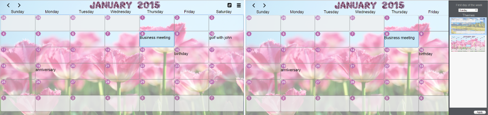
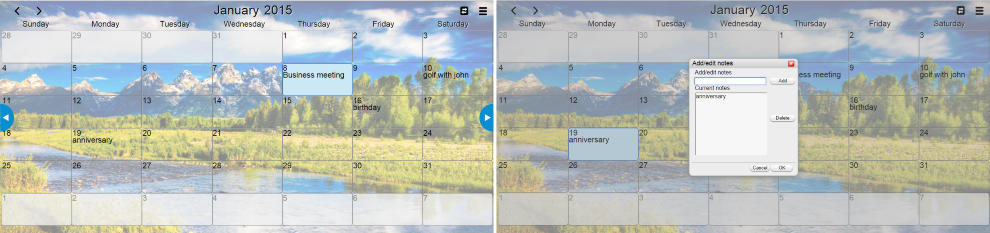

Calendar
========

* has keyboard navigation through the days of the month.
* can be personalised with two different themes and you can also choose which day of the week will appear as the first
day of the week.
* when you double click on a day it shows a dialog box where you can add,edit and remove notes for that day.
* Notes dialog box is also draggable and modal.
* saves to local storage your notes and can be synced to server (when available).
* uses touch events however this is only partially complete.

[Click here to try](https://cdn.rawgit.com/bend101/calendar/master/calendar.html)

